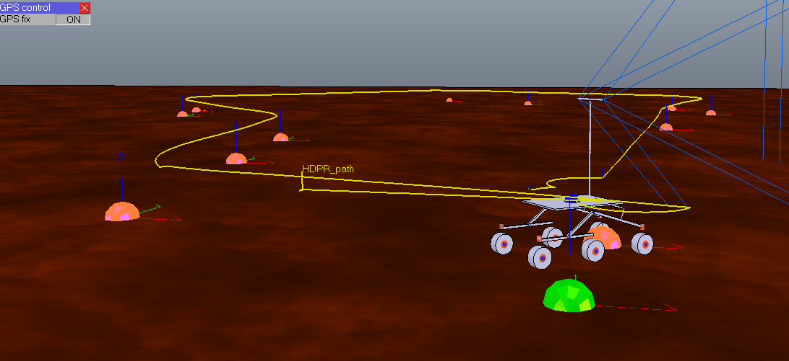

# Simulation component for HDPR in V-REP

## Overview

This component uses the [V-REP simulation library](https://github.com/hdpr-rover/simulation-vrep) to run a virtual HDPR in V-REP.

**Author: [Karl Kangur](mailto:karl.kangur@esa.int "Contact the author")  
Contact: [Martin Azkarate](mailto:Martin.Azkarate@esa.int "Contact the maintainer")  
Affiliation: Automation and Robotics Laboratories, ESTEC, ESA**

## Installation

### Dependencies

This package depends on the following packages:

* [simulation/vrep](https://github.com/hdpr-rover/simulation-vrep)
* [motion_translator](https://github.com/hdpr-rover/control-orogen-motion_translator)
* [command_arbiter](https://github.com/exoter-rover/control-orogen-command_arbiter)
* [waypoint_navigation](https://github.com/exoter-rover/control-orogen-waypoint_navigation)
* [locomotion_control](https://github.com/hdpr-rover/control-orogen-locomotion_control)
* [controldev](https://github.com/rock-drivers/drivers-orogen-controldev)
* [gps_heading](https://github.com/hdpr-rover/control-orogen-gps_heading)

### Building

In order to install, clone the latest version from this repository into your workspace under `hdpr/orogen/simulation_vrep`, add the following line to `autoproj/manifest` under `layout:`

    - hdpr/orogen/simulation_vrep

Execute the following to build the package:

    $ autoproj build

## Basic Usage

### simulation_vrep

#### Inputs

* **`trajectory`** (/std/vector\</base/Waypoint\>)
* **`currentWaypoint`** (/base/Waypoint)
* **`gps_heading_input`** (/base/samples/RigidBodyState)
* **`joints_commands`** (/base/commands/Joints)

#### Outputs

* **`joints_readings`** (/base/samples/Joints)
* **`gps_pose_samples`** (/base/samples/RigidBodyState)
* **`imu_pose_samples`** (/base/samples/RigidBodyState)
* **`gps_raw_data`** (/gnss_trimble/Solution)

#### Parameters

* **`yaw_drift`** (/double)

Simulated yaw drift value, applied periodically.

#### Deployements

* **`hdpr_simulation`**

A deployment launching all the required components for a simulation.

Note the the simulation in V-REP must be running before this deployment can be run. The scene can be found in the `vrep` folder and the launch file under `scripts`. Call the deployment with

    ruby test.rb
